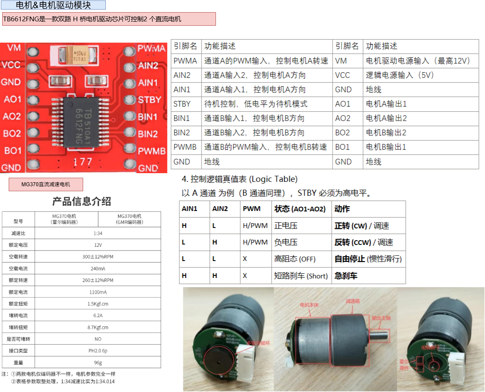
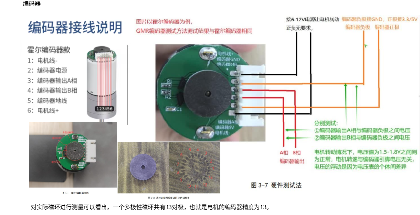
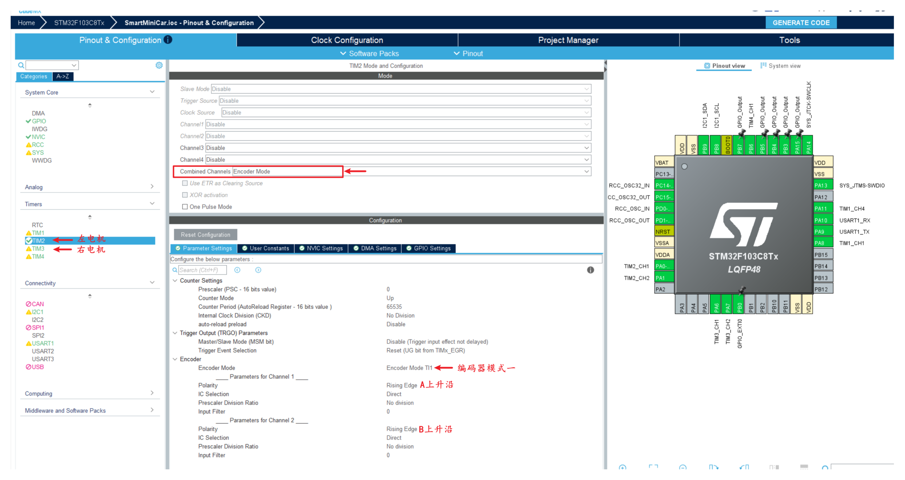
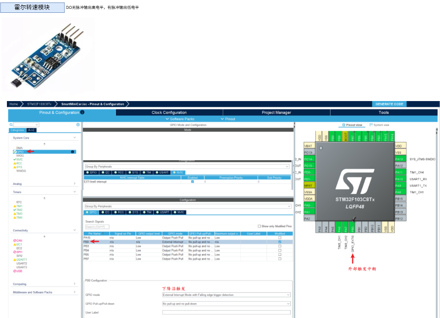
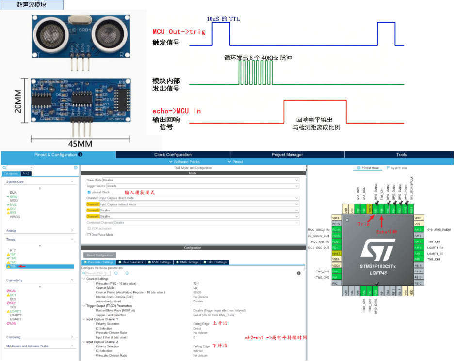
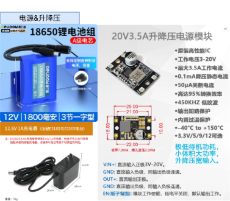
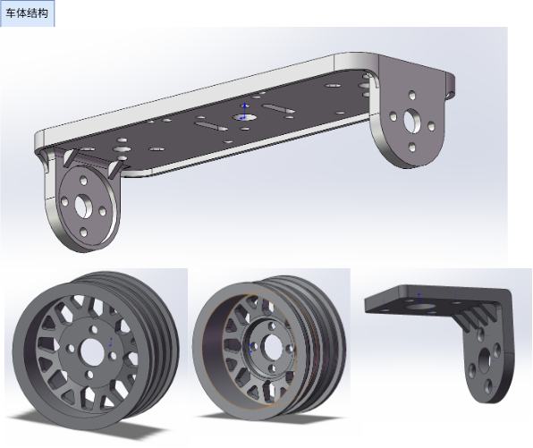
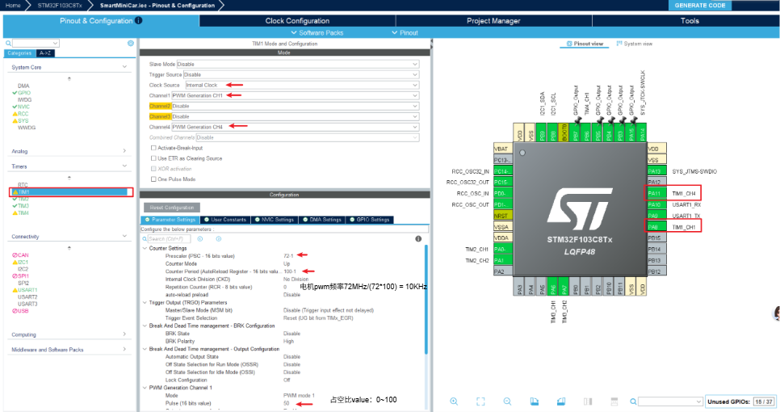
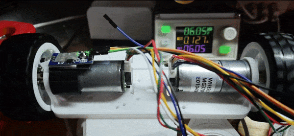
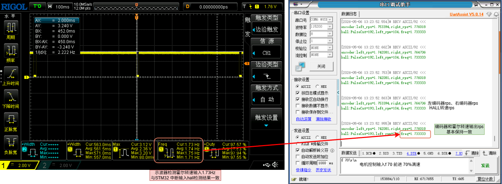

# 练习项目三、1.3智能小车
## 一、项目思路
智能小车项目的整体思路是：以主控芯片为核心，结合电机驱动模块控制小车运动，通过传感器采集小车运行状态，再利用 PID 控制算法对小车的速度、方向或循迹过程进行实时调节，使小车能够更加稳定、准确地完成前进、转弯、避障或循迹等任务。
其中，PID 的作用是根据目标值和实际值之间的误差进行动态调整，从而提高小车运行的平稳性和控制精度。
## 二、项目功能
1. 小车运动控制功能
能够实现前进、后退、左转、右转和停止等基本动作。

2. PID 速度调节功能
通过 PID 算法对电机转速进行闭环控制，使小车保持稳定速度运行。
3. PID 方向修正功能
在循迹或直线行驶过程中，通过 PID 对偏差进行修正，提高行驶稳定性。
4. 循迹功能
通过红外传感器检测地面轨迹，小车能够沿指定路线自动行驶。
5. 避障功能
通过超声波等传感器检测前方障碍物，在接近障碍物时自动减速、停止或绕行。
6. 状态显示功能
可通过 OLED 或其他显示模块显示当前速度、运行模式、传感器状态等信息。
## 三、硬件组成
1. 主控模块
作为整个小车系统的核心，用于采集传感器信息、执行 PID 算法并输出控制信号。
> stm32f103c8t6
2. 电机驱动模块
用于驱动左右电机运转，实现小车前进、后退和转向。
TB6612FNG电机驱动模块(替代旧款L298N)
> 双路 H 桥电机驱动芯片,可以驱动两路直流电机
3. 直流减速电机
作为小车的动力来源，带动车轮运动。
2个轮趣MG370直流减速电机P34_12V 霍尔编码器
> 电机资料：https://pan.baidu.com/s/1y1XS6GmnZMquCIRk9muSQg 【WHEELTEC】
> 减速比：1:34


4. 编码器模块
用于检测电机转速或车轮转动情况，为 PID 闭环控制提供反馈数据。
> 电机尾部霍尔编码器AB相
> 电机的编码器精度为 13



5. 霍尔转速模块
用于辅助检测电机转速，一圈一个脉冲


~~ 5. 红外循迹传感器 ~~
用于检测地面黑线或路径，实现小车自动循迹。
6. 超声波模块
用于检测前方障碍物距离，实现避障功能。

> 超声波模块：HC-SR04超声波传感器


7. OLED 显示屏
用于显示速度、模式、传感器数据和运行状态。
> 屏幕：OLED 128*64 屏幕
8. 电源模块
为主控、电机驱动、传感器和显示模块提供稳定电源。
> 电源：德力普12V 1800mAh【3节一字型】
> 升降压模块：TPS63020 DCDC直流锂电池开关电源 2035升降压 5V输出输入3-20V


9. 车体结构
包括底盘、车轮、电机固定架和各模块安装支架。

## 四、软件组成

### 4.1 根据项目功能，引脚分配如下：
#### TB6612 电机驱动引脚

| 功能 | 引脚 | 说明 |
|---|---|---|
| PWMA | PA8 (TIM1_CH1) | 左电机 PWM，高级定时器支持 |
| PWMB | PA11 (TIM1_CH4) | 右电机 PWM |
| AIN1 | PB5 | 左电机方向控制1 |
| AIN2 | PB4 | 左电机方向控制2 |
| BIN1 | PB3 | 右电机方向控制1 |
| BIN2 | PA15 | 右电机方向控制2 |
| STBY | PA12 | 驱动使能，高电平有效(待定 现在直接使用接了3.3V) |



#### 编码器引脚（霍尔编码器）

| 功能 | 引脚 | 说明 |
|---|---|---|
| 左编码器 A 相 | PA0 (TIM2_CH1) | TIM2 编码器模式 |
| 左编码器 B 相 | PA1 (TIM2_CH2) | TIM2 编码器模式 |
| 右编码器 A 相 | PA6 (TIM3_CH1) | TIM3 编码器模式 |
| 右编码器 B 相 | PA7 (TIM3_CH2) | TIM3 编码器模式 |

详见驱动模块：[编码器驱动](BSP/Encoder/encoder.c)
```c
// 启动定时器编码器模式
HAL_TIM_Encoder_Start(&htim2, TIM_CHANNEL_ALL);
HAL_TIM_Encoder_Start(&htim3, TIM_CHANNEL_ALL);


// 重置计数
__HAL_TIM_SET_COUNTER(&htim2, 0);
__HAL_TIM_SET_COUNTER(&htim3, 0);

//获取计数
__HAL_TIM_GET_COUNTER(&htim2);
__HAL_TIM_GET_COUNTER(&htim3)
```
#### 霍尔测速模块
无触发时为高电平，有触发时为低电平
| 功能 | 引脚 | 说明 |
|---|---|---|
| 电机霍尔测速器 | PB0 | GPIO EXTI0 外部中断输入，霍尔测速信号 |

[霍尔测速驱动](BSP/Hall/hall.c)

#### 超声波模块引脚

| 功能 | 引脚 | 说明 |
|---|---|---|
| Trig | PB7 | GPIO 输出，触发信号 |
| Echo | PB6 | GPIO 输入，回波信号(可接 TIM4 输入捕获) |

[超声波模块驱动](BSP/HCSR04/hcsr04.c)

#### OLED 显示屏引脚 && MPU6050 (I2C)

| 功能 | 引脚 | 说明 |
|---|---|---|
| SCL | PB8 (I2C1_SCL) | I2C1 时钟线 |
| SDA | PB9 (I2C1_SDA) | I2C1 数据线 |

#### 串口调试引脚

| 功能 | 引脚 | 说明 |
|---|---|---|
| uart_tx | PA9  | TX 数据线 |
| uart_rx | PA10 | RX 数据线 |

### 4.2 定时器配置

#### TIM1 — 电机 PWM

- Clock Source: Internal Clock
- Channel1 (PWMA): PWM Generation CH1
- Channel4 (PWMB): PWM Generation CH4
- Prescaler (PSC): 71 → 计数频率 = 72MHz / 72 = 1 MHz
- Counter Period (ARR): 99 → PWM 频率 = 1MHz / 100 = 10 kHz
- Pulse (CCR): 0~999 → 占空比 0~100%

> PWM 频率选择: TB6612 支持 0~100kHz，10kHz 是常用值，电机声音较小

#### TIM2 — 左编码器

- Combined Channel: Encoder Mode TI1
- Prescaler (PSC): 0
- Counter Period (ARR): 65535 (16位满量程)
- Encoder Polarity: Rising / Rising
- 计数模式: Up

#### TIM3 — 右编码器

- 同 TIM2 配置

#### TIM4 — 超声波输入捕获

- TIM4_CH1：Input Capture Direct Mode（直接模式）
  极性：Rising Edge 上升沿
- TIM4_CH2：Input Capture Indirect Mode（间接模式）
  极性：Falling Edge 下降沿
- Prescaler: 71 → 计数频率 = 1 MHz，1计数 = 1μs
- 用于测量 Echo 高电平持续时间

## 五、分模块测试
1、电机测试（PWM）

2、编码器测试

3、超声波测距测试

4、OLED 显示测试

5、霍尔转速测试



6、总体功能测试
```c
while (1)
  {
    uint32_t now = HAL_GetTick();

    /*串口命令*/
    if (uart_cmd_ready != 0U)
    {
      char command[UART_COMMAND_MAX_LEN];

      __disable_irq();
      strncpy(command, uart_cmd_line, sizeof(command));
      uart_cmd_ready = 0U;
      __enable_irq();

      printf("recv:%s\r\n", command);

      Motor_ParseCommand(command);
    }

    /*编码器*/
    if ((now - encoder_tick) >= 100)
    {
      encoder_tick = now;

      left_rps = Encoder_GetRPS(ENCODER_LEFT);
      right_rps = Encoder_GetRPS(ENCODER_RIGHT);

      printf("encoder:left_rps=%f,right_rps=%f\r\n", left_rps, right_rps);
    }

    /*霍尔*/
    if ((now - hall_tick) >= 100)
    {
      hall_tick = now;

      printf("hall:PulseCnt=%d,left_rpm=%d,freq=%f\r\n", Hall_GetPulse(), Hall_GetRPM(), Hall_GetRPS());
    }

    /*超声波*/
    if ((now - ultrasonic_tick) >= 50)
    {
      ultrasonic_tick = now;

      HCSR04_Trigger();
      distance_cm = HCSR04_GetDistanceCm();

      printf("dist=%.1fcm\r\n", distance_cm);
    }

    /*OLED显示*/
    if ((now - oled_tick) >= 200)
    {
      oled_tick = now;
      // 左电机编码器(tim2 encoder)
      sprintf(oled_buf, "ML:%5.2f rps", left_rps);
      OLED_ShowString(0, 0, oled_buf, 16, 0);
      // 右电机编码器(tim3 encoder)
      sprintf(oled_buf, "MR:%5.2f rps", right_rps);
      OLED_ShowString(0, 2, oled_buf, 16, 0);
      // 左电机霍尔转速（exti0)
      sprintf(oled_buf, "LH:%5.2f rps", Hall_GetRPS());
      OLED_ShowString(0, 4, oled_buf, 16, 0);
      // 超声波测距(tim3 ic)
      sprintf(oled_buf, "D:%5.1fCM", distance_cm);
      OLED_ShowString(0, 6, oled_buf, 16, 0);
    }
```



[阶段1视频](https://github.com/linfeng521/SmartMiniCar/blob/main/docs/imgs/阶段1.mp4)

[在线drawio文档笔记](https://app.diagrams.net/#Hlinfeng521/SmartMiniCar/main/docs/智能小车.drawio)
